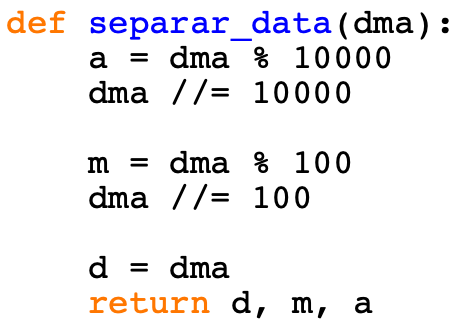
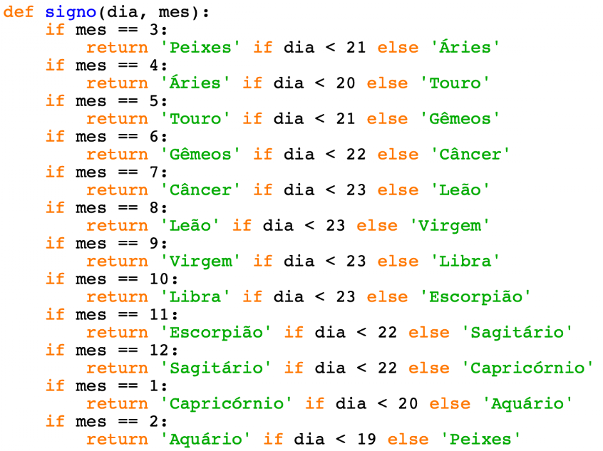
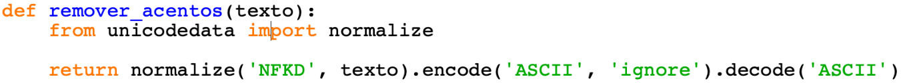
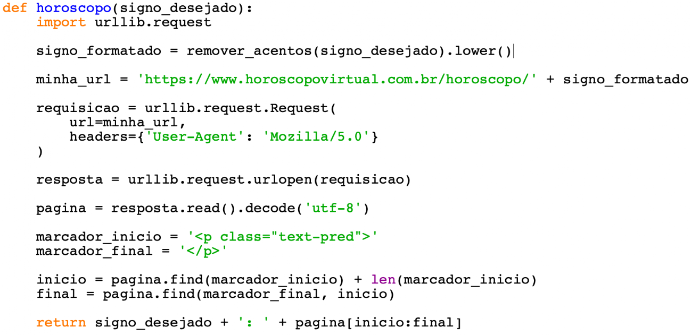
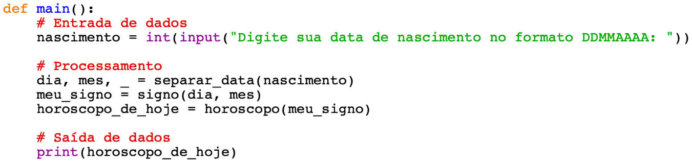
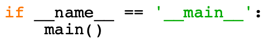

# Horóscopo do Dia

Programa em Python que, a partir da data de nascimento do usuário, identifica o signo e exibe a previsão do dia buscada diretamente do site [Horóscopo Virtual](https://www.horoscopovirtual.com.br).

Este projeto foi montado como um **quebra-cabeça**: cada imagem abaixo é uma peça do código. A ordem das imagens forma o programa completo.

---

## As peças do quebra-cabeça

### Peça 1 — `separar.png`


Função `separar_data(dma)`: recebe a data como número inteiro no formato `DDMMAAAA` e separa em dia, mês e ano usando divisão inteira e módulo.

---

### Peça 2 — `signo.png`


Função `signo(dia, mes)`: decide qual signo corresponde ao dia e mês de nascimento usando as datas de corte de cada signo.

---

### Peça 3 — `remover.png`


Função `remover_acentos(texto)`: remove acentos do nome do signo via normalização Unicode (`NFKD`), necessário para montar a URL sem caracteres especiais.

---

### Peça 4 — `horoscopo.png` ⚠️ Correção aplicada


Função `horoscopo(signo_desejado)`: faz uma requisição HTTP ao site e extrai **apenas** o texto da previsão do dia.

**Correção feita:** o código original da imagem usava `<p class="text-pred">` como marcador para localizar o texto no HTML. Porém, o site foi atualizado e essa classe não existe mais. A solução foi:

1. Localizar o bloco `<article class="text-wrapper">` no HTML
2. Buscar o primeiro `<p>` **dentro** desse bloco
3. Recortar apenas o texto entre `<p>` e `</p>`

Isso garante que só o texto da previsão seja exibido, sem HTML desnecessário.

---

### Peça 5 — `main.png`


Função `main()`: organiza o fluxo completo — lê a data, separa, descobre o signo, busca o horóscopo e imprime.

---

### Peça 6 — `name.png`


Bloco `if __name__ == '__main__'`: garante que `main()` só rode quando o arquivo é executado diretamente, não quando importado.

---

## Como executar

```bash
python app.py
```

Informe a data de nascimento no formato `DDMMAAAA` quando solicitado:

```
Digite sua data de nascimento no formato DDMMAAAA: 01011990
Capricornio: O dia pede escuta interna e planejamento silencioso...
```

---

## Explicação linha a linha

O arquivo `app.py` contém comentários em **cada linha**, escritos em linguagem simples para facilitar o estudo. Abaixo um resumo das funções:

| Função | Peça | O que faz |
|--------|------|-----------|
| `separar_data(dma)` | separar.png | Separa DDMMAAAA em dia, mês e ano |
| `signo(dia, mes)` | signo.png | Retorna o nome do signo |
| `remover_acentos(texto)` | remover.png | Remove acentos para montar a URL |
| `horoscopo(signo_desejado)` | horoscopo.png | Busca a previsão no site |
| `main()` | main.png | Orquestra tudo |
| `if __name__` | name.png | Ponto de entrada do programa |

---

## Detalhes da correção (`horoscopo.png`)

| | Código da imagem (original) | Código corrigido |
|--|--|--|
| Marcador usado | `<p class="text-pred">` | `class="text-wrapper"` + `<p>` |
| Problema | Classe removida do site | — |
| Resultado | Não encontrava o texto | Encontra e extrai só a previsão |

---

## Requisitos

- Python 3.x
- Bibliotecas padrão apenas (`urllib`, `unicodedata`) — sem instalações adicionais
- Conexão com a internet
